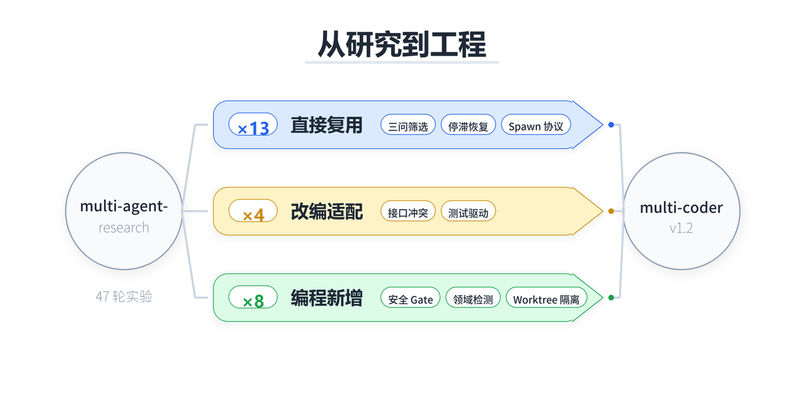
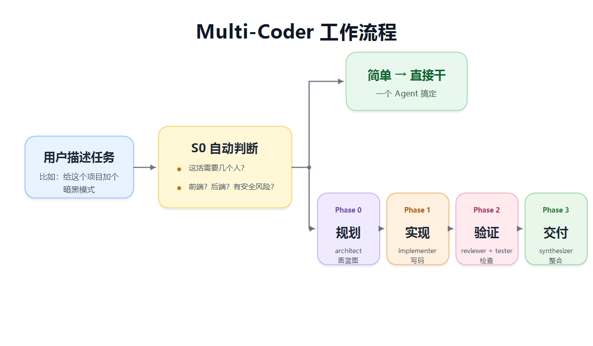
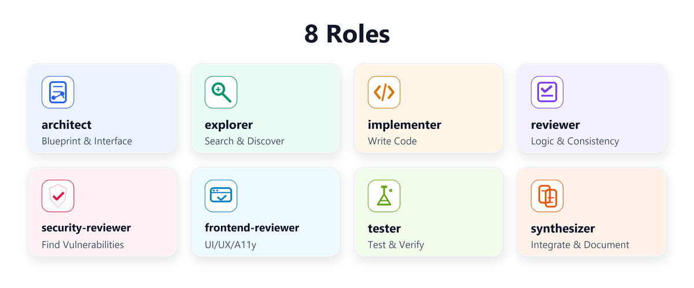

# Multi-Coder

**让 Claude Code 学会"找人帮忙"的编程协作 Skill。**

一个人写代码，容易顾此失彼——改了逻辑忘了安全，加了功能没跑测试。Multi-Coder 的想法很简单：复杂任务自动拆给几个专注的 Agent，各干各的，最后汇总。

## 这东西从哪来的

去年我做了个研究项目 [multi-agent-research](https://github.com/Evan-miwillbe/multi-agent-research)，花了 13 天跑了 47 轮实验，想搞清楚一个问题：**多个 AI 一起干活，到底哪些协作方式真的有用？**

实验做完，17 个机制里只有 2 个是核心必需的，其余大多是噪音。但这些被验证过的机制，放到编程场景里竟然也成立。于是就有了 Multi-Coder——把研究里验证过的东西，搬进真实的写代码过程。



## 它怎么工作

你正常跟 Claude Code 聊，描述你要做的事。Multi-Coder 会先判断：这活简单还是复杂？涉及前端、后端、还是都有？有没有安全风险？

简单的事，一个 Agent 直接干完。复杂的事，自动拆成四步走：



1. **规划** — architect 先看代码结构，定好接口。explorer 同时摸底有哪些依赖。
2. **实现** — implementer 按定好的接口写代码。默认一个人写，避免冲突；确实能拆开的才并行。
3. **验证** — reviewer 看逻辑，tester 跑测试，security-reviewer 找漏洞。三道关卡，不是走过场。
4. **交付** — synthesizer 把所有人的产出整合到一起，主 CC 做最终 commit。

## 八个角色



| 角色 | 干什么 | 能碰什么 |
|------|--------|----------|
| **architect** | 画蓝图，定接口契约 | 只读代码 + 写契约文件 |
| **explorer** | 搜代码库，摸清依赖关系 | 只读 |
| **implementer** | 按契约写功能代码 | 读写（限定文件范围） |
| **reviewer** | 审逻辑、一致性、可维护性 | 只读 |
| **security-reviewer** | 找安全漏洞（OWASP Top 10） | 只读 |
| **frontend-reviewer** | 看 UI、响应式、可访问性 | 只读 |
| **tester** | 写测试、跑测试 | 读写（仅测试文件） |
| **synthesizer** | 整合产出，写 changelog | 只读 + 写文档 |

## 几个设计原则

**能一个人干就别叫人。** 多 Agent 不是免费的——多花 4 倍 token，多一层沟通损耗。只有任务确实可拆、可验证、经验可积累时才值得。

**读可以并行，写默认串行。** 让三个 Agent 同时读代码找问题没问题；但同时改同一个文件，一定出事。

**接口先行。** 开工之前先定好契约，谁负责哪些文件、接口长什么样。不然并行写到一半发现对不上。

**测试说了算。** 不靠 Agent 的"我觉得没问题"放行，靠测试通过、lint 过关、typecheck 绿灯。

**卡住了会自救。** Agent 卡住不会死等——自动升级处理：换方法 → 缩小范围 → 主 CC 接管 → 找用户帮忙。

## 安装

```bash
git clone https://github.com/Evan-miwillbe/multi-coder.git ~/.claude/skills/multi-coder
```

在 Claude Code 里输入 `/multi-coder` 就能用。

## 项目结构

```
multi-coder/
├── SKILL.md               # 主文件（告诉 Claude 怎么干活）
├── foundations/            # 知识底座（为什么这么设计）
│   ├── theory.md          #   四支柱理论 + token 经济学
│   ├── evolution.md       #   从 research 到 coder 的演化故事
│   └── pain-points.md     #   编程多 Agent 的常见翻车
├── roles/                 # 八个角色的详细说明
├── references/            # 参考材料
│   ├── anti-patterns.md   #   反模式：别这么干
│   ├── security-checklist.md
│   └── learning-log.md    #   运行时自动积累的经验
└── scripts/
    ├── plan-tasks.sh
    └── run-tests.sh
```

## 相关

- [multi-agent-research](https://github.com/Evan-miwillbe/multi-agent-research) — 上游研究：47 轮实验的完整记录
